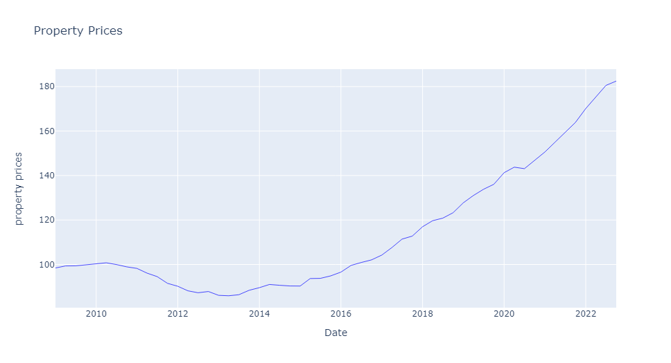

# ARIMA_housing_price_prediction

# Overview:

Housing prices have seen significant changes for the past years.
It is still very complex to predict housing prices as well as identify explanatory variables.
This project seeks to assess which economic variables, such as inflation, construction costs and
rental prices may explain the persistent increasing trend on property prices in Portugal. 
Aside from that we try to build a model to forecast property prices.

## Technical Objective:
Implement a model to confidently predict future property prices as well as try to identify 
relevant explanatory variables. To reach this goal, both machine learning and statistical models
were implemented using xgboost and statsmodels Python libraries.

## Data Sources:

Data was retrieved from three different institutions, namely FRED, OECD and INE.
The datasets are:
- [Construction costs](https://fred.stlouisfed.org/series/OPCNTB01PTM661N)
- [Credit to private sector](https://fred.stlouisfed.org/series/QPTPAMUSDA)
- [Consumer Price Index](https://fred.stlouisfed.org/series/PRTCPIALLMINMEI)
- [Rental Prices](https://fred.stlouisfed.org/series/CP0410PTM086NEST)
- [Permits Issued](https://fred.stlouisfed.org/series/PRTODCNPI03GPSAM)
- [Unemployment Rate](https://fred.stlouisfed.org/series/LRUN64TTPTQ156S)
- [Property Prices](https://fred.stlouisfed.org/series/QPTN628BIS)
- [Disposable Income](https://fred.stlouisfed.org/series/LRUN64TTPTQ156S)
- [Loan Interest Rates](https://www.pordata.pt/portugal/taxas+de+juro+sobre+novas+operacoes+de+emprestimos+(media+anual)+a+particulares+total+e+por+tipo+de+finalidade-2845)
- [Households'savings rate](https://www.pordata.pt/en/portugal/savings+rate+of+households-2340)

## Models used:

- **XGBoost** :  
Extreme Gradient Boosting, similar to Random Forests, 
XGBoost also consists of multiple decision trees. The term 'gradient boosting' comes from the idea of boosting or 
improving a single weak model by combining it with a number of other weak models in order 
to generate a collectively strong model.

In this project, XGBoost was used as a feature selection and prediction model.  
Since XGBoost returned unsatisfactory results to the problem an ARIMA model for forecasting was used.
- **ARIMA** : 
Autoregressive Integrated Moving Average is used for times series data. It tries to predict
future values based on past observations os property prices. It takes three inputs - the
number of lagged observations, the number of times of differencing of the data, and 
the size of the moving average window.
